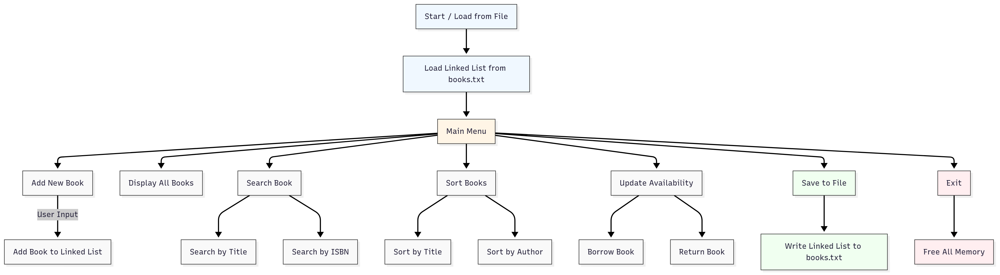

# Library Book Management System

## Type of Application

A C-based command-line tool built to manage a simple library system. The program is entirely text-based and runs in the terminal, using standard input and output for interaction. The application lets users add new books, search for them by title, author, or ISBN, and keep track of how many copies are available. All the data is saved to and loaded from a plain text file, so changes persist between runs. While it’s a basic system, it covers the core functionality you'd expect in a minimal library manager, and it’s a good example of how to use linked lists and file I/O in C.



---

## Purpose

The goal of this project was to build a simple system for managing books in a small library setting. It allows users to store, find, and update book records efficiently. More than just functionality, the project is meant to demonstrate how core C programming concepts like data structures, file handling, and modular code can come together in a practical application.

---

## Key Functionalities

- Adds a new book from user input
- Displays all stored books
- Searches for books by title or ISBN
- Sorts books by title or author
- Updates available copies(Borrowed/Returned
- Saves book records to a file
- Loads book records from a file
- Exits and frees all dynamically allocated memory

---

## Data Representation

Book information is stored in the following format in a text file (`books.txt`):

```

Title|Author|ISBN|TotalCopies|AvailableCopies

```

Example:
```

Foundation|Isaac Asimov|9780553293357|5|3

````

This allows for easy parsing and writing to file.

---

## Data Structure

Books are stored in a singly linked list using the following `struct`:

```c
typedef struct Book {
    char title[100];
    char author[100];
    char isbn[20];
    int total_copies;
    int available_copies;
    struct Book *next;
} Book;
````

Each book is dynamically allocated and linked to the next.

---

## Menu Options

The system provides the following menu options:

1. Add a New Book
2. Display All Books
3. Search Book by Title
4. Search Book by ISBN
5. Update Availability (Borrow/Return)
6. Sort Books (by Title or Author)
7. Save to File
8. Load from File
9. Exit

Users interact by entering the number corresponding to the desired option.

---

## Technical Implementation

* **Language**: C (standard C99)
* **Data Storage**: Singly linked list in memory
* **Persistence**: Book data is saved to and loaded from `books.txt`
* **Memory Management**: `malloc` and `free` are used to manage dynamic memory
* **Input Validation**:

  * All user inputs are validated
  * Menu input must be numeric
  * Book data is checked for logical constraints (e.g., available ≤ total)
* **Modular Design**:

  * `main.c`: Entry point, user menu
  * `book.c`: Book-related functions (add, display, free)
  * `file_ops.c`: Load/save from/to file
  * `utility.c`: Search, sort, availability update, input helpers
  * `book.h`: Struct and function declarations

Compile using:

```bash
gcc -Wall -Werror -Wextra -std=c99 main.c book.c file_ops.c utility.c -o library
```

Run the application with:

```bash
./library
```

---

## Outcome

This project demonstrates how to build a functional system in C with persistent storage, dynamic memory usage, and a clean user interface via the terminal. It highlights key software engineering principles like modularity, data abstraction, and memory safety.

---

## License

This project is for educational purposes only and is part of the **Holberton School** / *Holberton Basics* curriculum.

---

## Authors

<strong>Alba Eftimi</strong> &nbsp;&nbsp;&nbsp;&nbsp;&nbsp;&nbsp;&nbsp;&nbsp;&nbsp;&nbsp;&nbsp;&nbsp;&nbsp;&nbsp;&nbsp;&nbsp;&nbsp;&nbsp;&nbsp;&nbsp; <strong>Sokol Gjeka</strong>  
GitHub: <a href="https://github.com/abfabs">abfabs</a> &nbsp;&nbsp;&nbsp;&nbsp;&nbsp;&nbsp;&nbsp;&nbsp;&nbsp;&nbsp;&nbsp;&nbsp;&nbsp;&nbsp;&nbsp;GitHub: <a href="https://github.com/sokolgj19">sokolgj19</a>

---

<p align="center">
  <em>August 2025</em><br>
  <em>Tirana, Albania</em>
</p>

```
